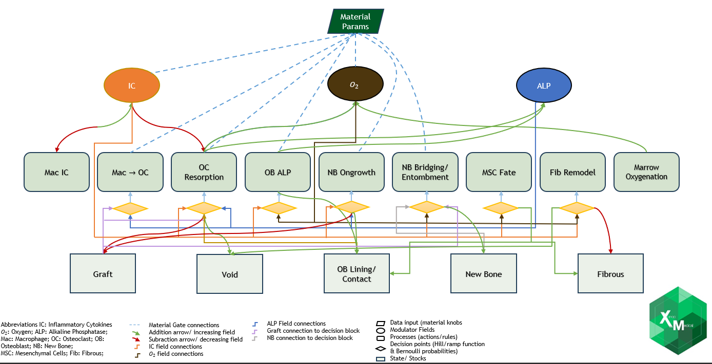
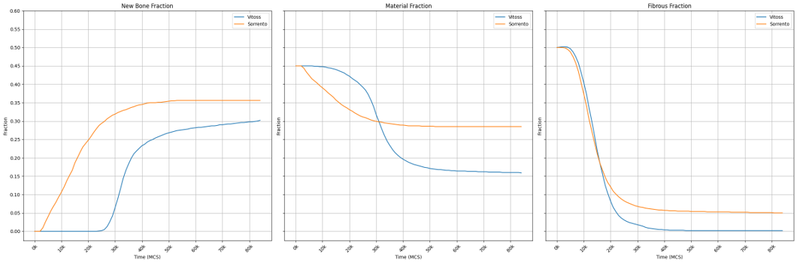

# Bone Graft Healing CPM Model

##  Overview
This repository contains a **Cellular Potts Model (CPM)** simulation of rabbit femoral defect healing, implemented in **CompuCell3D (CC3D)**.  
The model captures essential biological processes during bone graft healing, such as:

- **MSC proliferation and differentiation**
- **Osteoblast (OB) adhesion and ALP secretion**
- **Osteoclast (OC) resorption dynamics**
- **Fibrous tissue remodeling**
- **New Bone (NB) formation** via ongrowth, bridging, and entombment  
- Influence of **material properties ("material knobs")** such as porosity, resorption rate, osteoconductivity, inflammation index, and ALP secretion.

The model is tuned against **published in-vivo rabbit defect studies (Vitoss vs Sorrento grafts)**, aligning simulated histomorphometry curves with experimental outcomes.

---

## Model Workflow



The simulation links **material parameters** and **biological signals** to the healing outcome:

- **Inputs:**  
  - Material parameters (resorption rate, porosity, osteoconductivity, etc.)  
  - Biological fields: inflammatory cytokines (IC), oxygen (O₂), alkaline phosphatase (ALP)  

- **Processes (middle layer):**  
  - Macrophage → Osteoclast differentiation  
  - Osteoclast resorption  
  - Osteoblast activity (ALP secretion, lining, contact)  
  - New bone ongrowth, bridging, entombment  
  - Mesenchymal stem cell (MSC) fate  
  - Fibrous tissue remodeling  

- **States (bottom layer):**  
  - Graft, Void, Osteoblast lining, New Bone, Fibrous tissue  

- **Arrows:**  
  - ✅ Green → Positive effect / addition  
  - ❌ Red → Negative effect / removal  
  - 🔹 Dashed → Material parameter modulation  

➡️ Together, these capture how **material properties influence biological decisions**, leading to realistic healing dynamics.


---

## ⚙️ Installation

### 1. Install CompuCell3D (GPU optional)
- Follow [official CC3D installation](https://compucell3d.org/Downloads)  
- For GPU acceleration:
  - Install **CUDA Toolkit** compatible with your GPU & driver.
  - Create a conda environment and install CC3D GPU build:
    ```bash
    conda create -n cc3d_gpu python=3.10
    conda activate cc3d_gpu
    pip install cc3d
    ```

### 2. Clone the Repository
```bash
git clone https://github.com/Harish2102/CPM-Model-for-Femoral-Data-Study-Xenco-Medical.git
```

---

## ▶️ Running the Simulation
1. Launch **CC3D Player** (`cc3d -i`).
2. Open the project:
   - `BoneGraftHealing_V3_1.cc3d`
3. Ensure the Python steppables are in the same directory:
   - `Simulation/BoneGraftHealing_V3_1Steppables.py`
   - `Simulation/BoneGraftHealing_V3_1.py`
   - `Simulation/BoneGraftHealing_V3_1.xml`
5. Press **Run**.  
   - Tissue dynamics will appear in the CC3D Player.
   - Time series outputs (NB, Fibrous, Graft, Void fractions) are logged for analysis every 1000 MCS.

---

## File Structure
```
├── Simulation/
│   └── BoneGraftHealing_V3_1.cc3d                        # Core CC3D simulation file
│   └── BoneGraftHealing_V3_1.py                          # Main python script to run all the steppables
│   └── Simulation/BoneGraftHealing_V3_1.xml              # XML file
│   └── Simulation/BoneGraftHealing_V3_1Steppables.py     # Steppables file with logic 
```

---

## Biological Parameters ("Material Knobs")
- **Macro-Porosity (Macro-P)** → vessel ingress/ oxygen and nutrient perfusion
- **Micro-Porosity (Micro-P)** → OC surface access
- **Resorption Rate (RR)** → Graft lifetime
- **Osteoconductivity (OSC)** → OB adhesion, NB ongrowth
- **Inflammation Index (IFI)** → IC amplitude, Mac/OC priming
- **ALP Secretion** → NB formation probability
---

## 📈 Results
- Sorrento vs Vitoss grafts reproduced in silico
- Fraction curves of NB, graft, and fibrous tissue closely match experimental histology

👉Comparative output between Sorrento and Vitoss:


---

## Future Work
- Add angiogenesis and VEGF signaling.
- Improve OB–OC coupling through RANKL/OPG fields.
- Expand calibration dataset across multiple graft materials.
- Perform **paired in-vivo & simulation trials** to validate predictive power.
- scaling strategy to match quantitative biomaterial properties to in-silico 'material knobs'
- Optimise code base and remove redudancy in loops and Steppables and reduce time and space complexity

---

## References
- Walsh et al., (2014). *Femoral Defect Study – Haider Biologics.*
- CompuCell3D: [https://compucell3d.org](https://compucell3d.org)
- Hill equation (biochemistry). (n.d.). In Wikipedia. Retrieved August 16, 2025, from https://en.wikipedia.org/wiki/Hill_equation_(biochemistry)
- Santillán, M. (2008). On the use of Hill functions in mathematical models of gene regulatory networks. Mathematical Modelling of Natural Phenomena, 3(2), 85–97. https://doi.org/10.1051/mmnp:2008056
- Radivoyevitch, T. (2009). Mass action models versus the Hill model: An analysis of tetrameric human thymidine kinase 1 cooperativity. Biology Direct, 4(49). https://doi.org/10.1186/1745-6150-4-49
- Johnston, R. J., Jr., Desplan, C., & Doe, C. Q. (2010). Stochastic mechanisms of cell fate specification across species. PLoS Computational Biology, 6(3), e1000823. https://doi.org/10.1371/journal.pcbi.1000823
- Yamaguchi, H., Kawaguchi, K., & Sagawa, T. (2017). Dynamical crossover in a stochastic model of cell fate decision. Physical Review E, 96(1), 012401. https://doi.org/10.1103/PhysRevE.96.012401


## Disclaimer

All rights reserved.
This code is proprietary and confidential.
This repository is shared for demonstration and portfolio purposes.


